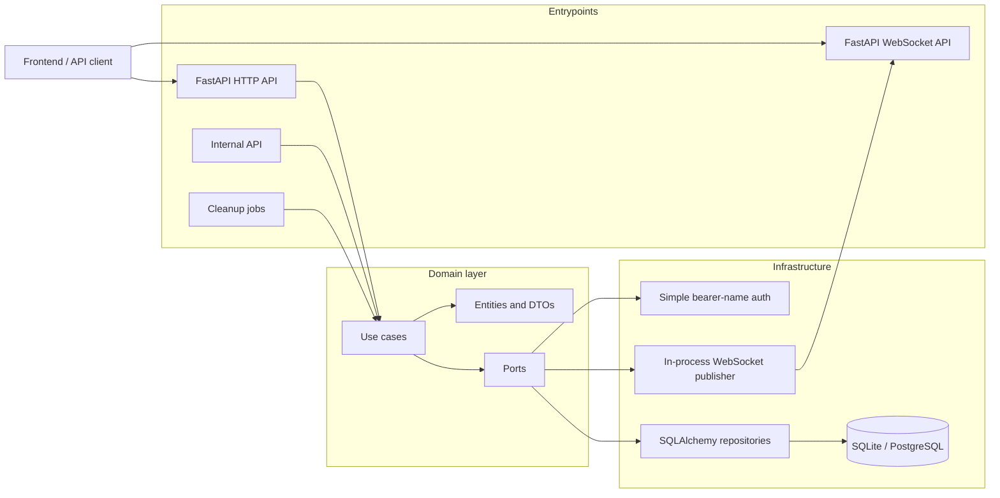
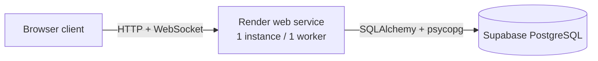

# Events Service

Realtime event management backend built with **Python**, **FastAPI**, **SQLAlchemy**, **Alembic**, and a ports-and-adapters architecture.

The service manages events, locations, participants, and realtime notifications. HTTP endpoints are the source of truth; WebSocket notifications tell connected clients when they should update their local UI state.

## Live API

- Swagger UI: <https://tt-events-realtime-service-python.onrender.com/docs>
- Health check: <https://tt-events-realtime-service-python.onrender.com/health>
- WebSocket: `wss://tt-events-realtime-service-python.onrender.com/ws/events`

## What this service does

- Creates, lists, updates, cancels, and restores events.
- Creates or reuses locations when creating events.
- Lets users join and leave events.
- Broadcasts realtime changes to connected WebSocket clients.
- Persists data through SQLAlchemy repositories.
- Manages database schema with Alembic migrations.
- Keeps domain rules independent from FastAPI, SQLAlchemy, and WebSocket infrastructure.

## Architecture in one picture



## Runtime model

This project is intentionally deployed as a **single fixed instance**.

The current WebSocket publisher keeps active connections in process memory. That is appropriate for one Render instance with one worker. Horizontal scaling, multiple workers, or multiple replicas would require replacing the realtime adapter with a shared broker such as Redis Pub/Sub, PostgreSQL `LISTEN/NOTIFY`, or a managed messaging service.

Current deployment model:



## Requirements

- Python 3.10+
- SQLite for local development
- PostgreSQL for the hosted deployment

## Installation

```bash
python -m venv .venv
source .venv/bin/activate
python -m pip install --upgrade pip
python -m pip install -e ".[fastapi,dev]"
```

For PostgreSQL:

```bash
python -m pip install -e ".[fastapi,dev,postgres]"
```

## Configuration

Create a local environment file:

```bash
cp .env.example .env
```

Main variables:

| Variable | Description |
|---|---|
| `APP_NAME` | Service name used in logs. |
| `APP_ENV` | Runtime environment name. |
| `EVENTS_DATABASE_URL` | SQLAlchemy database URL. Use `sqlite:///data/events.db` locally or `postgresql+psycopg://...` for PostgreSQL. |
| `SQLALCHEMY_ECHO` | Enables SQL logging when set to `true`. |
| `CORS_ALLOWED_ORIGINS` | Comma-separated allowed browser origins. |
| `EVENT_DELETION_DELAY_MINUTES` | Delay before completed events are eligible for cleanup. |
| `CANCELED_EVENT_DELETION_DELAY_MINUTES` | Delay before canceled events are eligible for cleanup. |
| `LOCATION_UNUSED_DELETION_DELAY_MINUTES` | Delay before unused locations are eligible for cleanup. |
| `LOG_LEVEL` | `DEBUG`, `INFO`, `WARNING`, `ERROR`, or `CRITICAL`. |

## Database setup

The application does not create tables at startup. The schema is managed with Alembic.

```bash
alembic upgrade head
```

For local SQLite, this creates or upgrades the configured database file. For Render + Supabase, run the migration step before starting the web service.

## Run locally

User-facing API:

```bash
uvicorn src.entrypoints.fastapi.wsgi:app --reload
```

Internal API:

```bash
uvicorn src.entrypoints.fastapi.wsgi_internal:app --reload --port 8001
```

Cleanup jobs:

```bash
python -m src.entrypoints.jobs.delete_expired_events
python -m src.entrypoints.jobs.delete_unused_locations
```

## Public HTTP API

| Method | Path | Auth | Purpose |
|---|---|---|---|
| `GET` | `/events` | No | List visible events. |
| `POST` | `/events` | Bearer username | Create an event. |
| `GET` | `/events/{event_id}` | No | Get event details. |
| `PATCH` | `/events/{event_id}` | Bearer username | Update an event. |
| `POST` | `/events/{event_id}/cancel` | Bearer username | Cancel an event. |
| `POST` | `/events/{event_id}/uncancel` | Bearer username | Restore a canceled event. |
| `GET` | `/locations` | No | List locations. |
| `PATCH` | `/locations/{location_id}` | No | Update a location. |
| `POST` | `/joiners` | Bearer username | Join an event. |
| `GET` | `/events/{event_id}/joiners` | No | List active joiners. |
| `DELETE` | `/joiners/{event_id}` | Bearer username | Leave an event. |

Protected endpoints use a simple identity adapter:

```http
Authorization: Bearer <user-name>
```

The bearer value is treated as the user's display name and resolved to a local user record.

## WebSocket API

Connect to:

```text
ws://localhost:8000/ws/events
```

or in production:

```text
wss://tt-events-realtime-service-python.onrender.com/ws/events
```

The WebSocket emits notifications after successful mutations such as event creation, updates, cancellation, location updates, joins, and leaves.

For client behavior and message examples, see [`docs/WEBSOCKET_CLIENT_GUIDE.md`](./docs/WEBSOCKET_CLIENT_GUIDE.md).

## Quality checks

```bash
pytest
pylint src tests
radon cc src -s -a
```

Current validation of this version:

```text
109 passed
Total coverage: 86.38%
```

## Documentation

The compact technical documentation is in:

- [`docs/TECHNICAL_DOCUMENTATION.md`](./docs/TECHNICAL_DOCUMENTATION.md)
- [`docs/WEBSOCKET_CLIENT_GUIDE.md`](./docs/WEBSOCKET_CLIENT_GUIDE.md)
