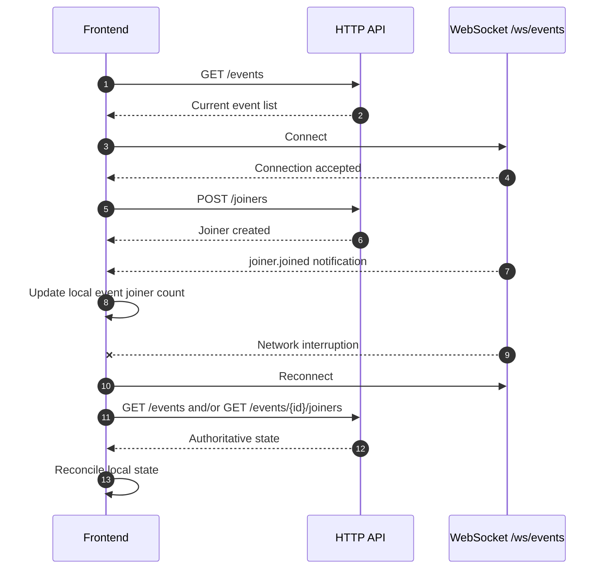
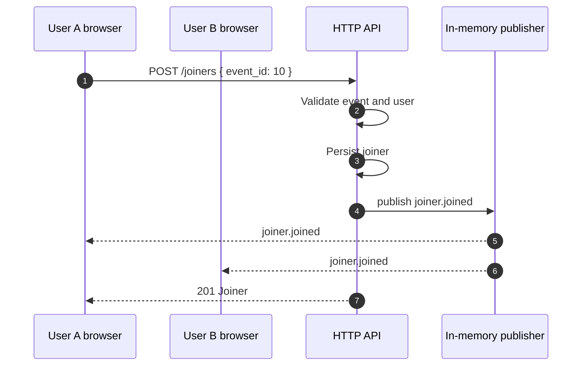
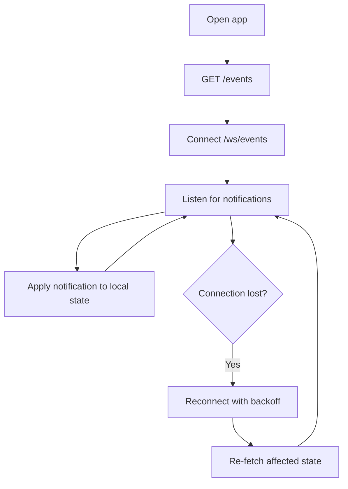

# WebSocket Client Guide

The WebSocket endpoint is a realtime notification channel for the user-facing API.

```text
/ws/events
```

Production URL:

```text
wss://tt-events-realtime-service-python.onrender.com/ws/events
```

Local URL:

```text
ws://localhost:8000/ws/events
```

## How the frontend should use it

The recommended frontend model is:

1. Load initial state using HTTP.
2. Open the WebSocket connection.
3. Apply incoming notifications to local state.
4. Re-fetch authoritative state after reconnects or when state might be stale.



## Message shape

All domain notifications use this structure:

```json
{
  "id": "6ecf9ef7-2217-4a5f-971e-31fa77a4fbe2",
  "type": "joiner.joined",
  "event_id": 1,
  "location_id": null,
  "payload": {},
  "occurred_at": "2026-06-16T20:15:30.000000Z"
}
```

Fields:

| Field | Meaning |
|---|---|
| `id` | Unique notification ID. Useful for deduplication. |
| `type` | Domain event type. |
| `event_id` | Related event ID when the notification is event-scoped. |
| `location_id` | Related location ID when the notification is location-scoped. |
| `payload` | Current persisted representation of the changed resource or event-specific data. |
| `occurred_at` | Server-side notification timestamp in UTC. |

## Notification types

| Type | Trigger | Suggested frontend reaction |
|---|---|---|
| `event.created` | A new event was created. | Add it to the list or re-fetch `/events`. |
| `event.updated` | An event was updated. | Merge the event payload into local state. |
| `event.canceled` | An event was canceled. | Mark the event as canceled. |
| `event.uncanceled` | A canceled event was restored. | Mark the event as active again. |
| `location.updated` | A location was updated. | Update the location and any event displaying it. |
| `joiner.joined` | A user joined an event. | Update joiner list/count for that event. |
| `joiner.left` | A user left an event. | Update joiner list/count for that event. |

## Ping

Clients may send:

```json
{
  "action": "ping"
}
```

The server responds:

```json
{
  "type": "pong"
}
```

This can be used by the frontend to keep the connection active or verify that the socket is still usable.

## Join flow example



## Reconnection strategy

WebSocket delivery is best-effort. A client can miss messages while offline or while reconnecting. Because of that, the frontend should treat HTTP as the authoritative state source.

Recommended behavior:



Suggested backoff:

```text
1s, 2s, 4s, 8s, max 15s
```

After reconnecting, re-fetch one of these depending on the screen:

```http
GET /events
GET /events/{event_id}
GET /events/{event_id}/joiners
```

## Client-side state rule

Use WebSocket notifications for fast UI updates, but use HTTP responses for certainty.

Good pattern:

```text
HTTP initial load -> WebSocket live updates -> HTTP reconciliation after reconnect
```

Avoid assuming that the WebSocket stream is a complete event history. It is a live notification channel for the single running instance.

## Deployment constraint

The current publisher is process-local. It only broadcasts to WebSocket connections attached to the same running process.

That matches the current deployment:

```text
Render web service: one instance, one worker
```

A multi-instance deployment would need a shared broker between instances before WebSocket fan-out.
